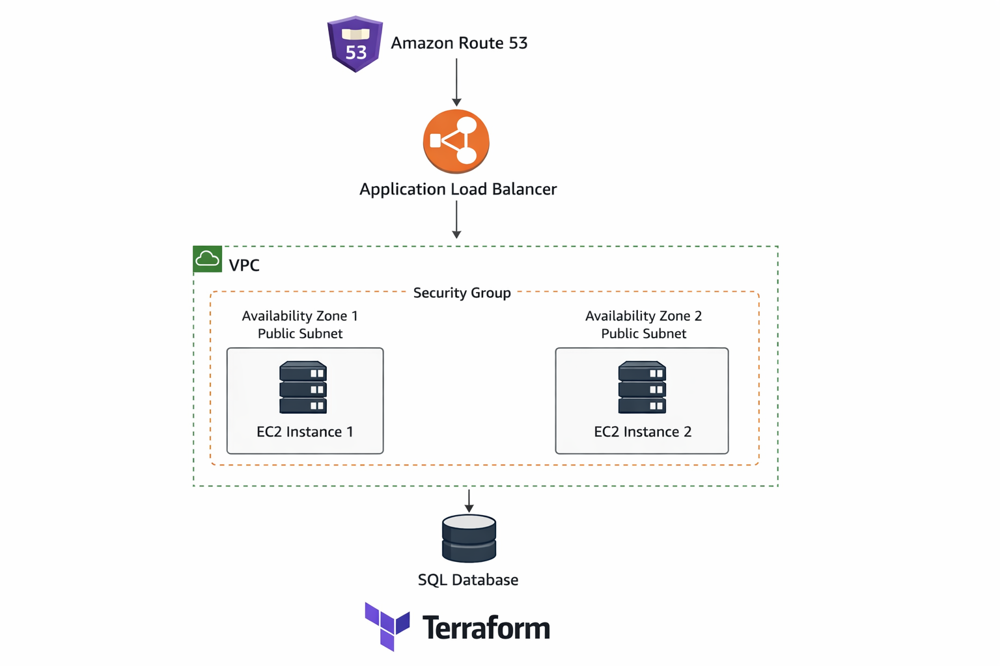

# AWS Terraform Infrastructure Project

## Project Overview
This project demonstrates **automated provisioning of AWS cloud infrastructure** using **Terraform**.  
The infrastructure is **highly available, scalable, and secure**, following real-world best practices.

The setup includes **EC2 instances, Application Load Balancer, VPC with multi-AZ subnets, security groups, and IAM roles**, all managed via Terraform as **Infrastructure as Code (IaC)**.

---

## Architecture
The infrastructure consists of:

- **VPC**: Custom Virtual Private Cloud with public subnets across **multiple Availability Zones**.
- **EC2 Instances**: Web servers running HTTP service.
- **Application Load Balancer (ALB)**: Distributes traffic evenly across EC2 instances.
- **Security Groups**: Allow HTTP access and control inbound/outbound traffic.
- **Terraform**: Automates creation, updates, and destruction of the infrastructure.
- **Outputs**: Public IPs of EC2 instances and ALB DNS for easy access.

## Architecture Diagram

This diagram shows the AWS cloud infrastructure deployed using Terraform.  
It illustrates a **highly available web application** with multi-AZ EC2 instances behind an Application Load Balancer (ALB), connected to a SQL database.




## How to Run
1. **Initialize Terraform**:
```bash
   terraform init

2. Preview changes:
terraform plan

3. Apply infrastructure:
   terraform apply

4. Destroy infrastructure when done:
   terraform destroy
